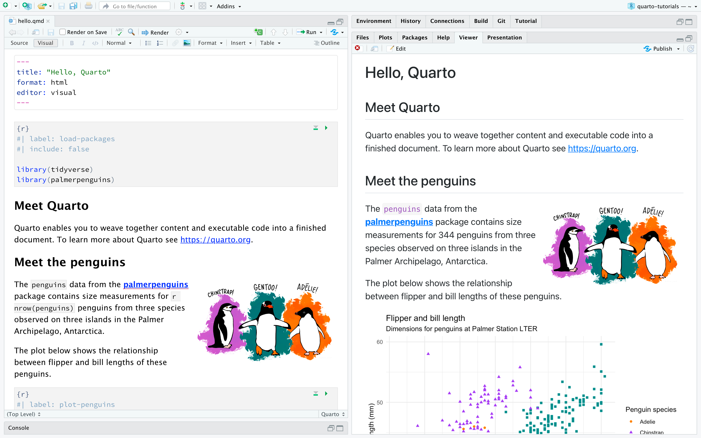

## Notes {visibility="hidden"}

<!-- Use menti on your phone to activate links -->
<!-- https://www.mentimeter.com/ -->

# Bridge-In

## Mentimeter {background-iframe=''}

<!--  -->

## Scientific Method {background-iframe=''}

<!--  -->

## Scientific Method {auto-animate=true .smaller}

What is the scientific method (broadly)?

1. Define a question
2. Gather information and resources (observe)
3. Form an explanatory hypothesis
4. Test the hypothesis by performing an experiment and collecting data in a reproducible manner
5. Analyze the data
6. Interpret the data and draw conclusions that serve as a starting point for a new hypothesis
7. <p style="color:red;">Publish results</p>
8. <p style="color:red;">Retest (frequently done by other scientists)</p> 

::: {.notes}

:::

## Scientific Method {auto-animate=true}

::: {.nonincremental style="margin-top: 150px; font-size: 1.5em; color: red;"}
7. Publish Results
8. Retest (frequently done by other scientists)
:::

## Problem 
- In 2011, John Ioannidis^[Ioannidis JPA (2005) Why most published
research findings are false. PLoS Med 2(8): e124.]
 published 

- Why?
  - Studies are underpowered
  - Current incentives lead scientists to publish quantity over quality
  - No incentives for scientists to replicate other studies
  - More...

::: {.notes}
John suggested that the majority of all published papers at the time were likely not true. Or put another way, wouldn't be reproduced
:::
## Problem

Was he right?

- In 2015, the Open Science Collaboration sampled studies from prominent journals to estimate the replicability of psychological research.^[Open Science Collaboration. Estimating the reproducibility of psychological science. Science 349, aac4716 (2015).]

## Problem {background-iframe=''}

<!--  -->

## Problem {.nonincremental}


::: {.cell}
::: {.cell-output-display}
{#fig-opensci width=960}
:::
:::


Out of 100 independently performed replications, only 39% were subjectively labelled as successful replications, and on average, the effects were roughly half the original size ^[https://www.nature.com/articles/s44271-023-00003-2]

::: {.notes}
[https://www.nature.com/articles/s44271-023-00003-2]

Out of 100 independently performed replications, only 39% were subjectively labelled as successful replications, and on average, the effects were roughly half the original size
:::

## Problem 

Not just in Psychology: 

- animal behaviour^[Farrar, B. G., Boeckle, M. & Clayton, N. S. Replications in comparative cognition: what should we expect and how can we improve? Anim. Behav. Cognit. 7, 1 (2020).]; 
- cancer biology^[Errington, T. M. et al. Investigating the replicability of preclinical cancer biology. Elife 10, e71601 (2021).]; 
- economics^[Camerer, C. F. et al. Evaluating replicability of laboratory experiments in economics. Science 351, 1433–1436 (2016).]
- pharmaceutical industry^[Begley CG, Ellis LM (2012) Drug development: Raise standards for preclinical cancer research. Nature
483: 531–533. doi: 10.1038/483531a PMID: 22460880]
- neuroscience^[K.S. Button, J.P.A. Ioannidis, C. Mokrysz, B.A. Nosek, J. Flint, E.S.J. Robinson, M.R. Munafò. Power failure: Why small sample size undermines the reliability of neuroscience. Nat Rev Neurosci, 14 (2013), pp. 365-376]
- neuroimaging^[Marek, S., Tervo-Clemmens, B., Calabro, F.J. et al. Reproducible brain-wide association studies require thousands of individuals. Nature 603, 654–660 (2022). https://doi.org/10.1038/s41586-022-04492-9]
- clinical trials^[Carlisle, J. B. Anaesthesia 76, 472–479 (2021).]

::: {.notes}
:::

## Problem

- For clinical trials: 44% contained at least some flawed data:^[Carlisle, J. B. Anaesthesia 76, 472–479 (2021).]
  - impossible statistics, 
  - incorrect calculations, 
  - or duplicated numbers or figures
  - 26% of trials were impossible to judge: either due to incompetence or faked data

## Problem

- Publishing irreproducible results is worse than not publishing: more difficult to eliminate an idea than it is to introduce it^[C. Piller. Disgraced COVID-19 studies are still routinely cited. Science, 371 (2021), pp. 331-332; E.M. Bucci. On zombie papers. Cell Death Dis, 10 (2019), p. 189; S.B. Nissen, T. Magidson, K. Gross, C.T. Bergstrom. Publication bias and the canonization of false facts. eLife, 5 (2016), Article e21451] 

- Spurious results can mislead other researchers who conduct follow-up investigations or try to integrate findings into broader theories.

::: {.notes}
For the clinical trials; for more than 150 trials, the author of the paper got access to anonymized individual participant data (IPD). By studying the IPD spreadsheets, he judged that 44% of these trials contained at least some flawed data: impossible statistics, incorrect calculations or duplicated numbers or figures, for instance. And 26% of the papers had problems that were so widespread that the trial was impossible to trust, he judged — either because the authors were incompetent, or because they had faked the data.
:::


## What Can We Do? 

- Many solutions are needed; far outside the scope of this talk

- **One thing we can do is change the way we write papers.** {width=55% height=55%}

- Currently, papers are written and published in a way that results in **errors** and the inability to **computationally reproduce** results.

## What Can We Do?

- **Errors**: a 2016 paper by Nuijten et al.^[Nuijten, Michèle B, Chris HJ Hartgerink, Marcel ALM van Assen, Sacha Epskamp, and Jelte M Wicherts. 2016. “The Prevalence of Statistical Reporting Errors in Psychology (1985–2013).” Behavior Research Methods 48 (4). Springer: 1205–26.] found that 
  - nearly **half** of all papers had errors in them;
  - over **10%** of p-values in published papers were inconsistent with the reported details of the statistical test
  - 1.6% were what they called "grossly" inconsistent, e.g. difference between the p-value and the test statistic meant that one implied statistical significance and the other did not

## What Can We Do?

- **Computational reproducibility**: a 2021 paper by Hardwicke et al.^[T.E. Hardwicke, M. Bohn, K. MacDonald, E. Hembacher, M.B. Nuijten, B.N. Peloquin, et al. Analytic reproducibility in articles receiving open data badges at the journal Psychological Science: An observational study. R Soc Open Sci, 8 (2021), Article 201494] attempted to reproduce results from 25 published papers that publicly shared their data and code:
  - found substantial numerical discrepancies between reported statistical values and values obtained from reproduction attempts in **64%** of these papers

## What Can We Do?

This is where **Reproducible Papers** come in...


# Learning Goals

## Learning Goals

By the end of the talk, the audience should:

- Know what a reproducible manuscript is,
- Understand some reasons why scientists should be writing their manuscripts this way,
- Know what Markdown, Knitr, Pandoc, LaTeX, Jupyter Notebook, R/RMarkdown, and Quarto are,
- Know the basics of the syntax for Markdown, R and Quarto,
- See how to integrate author information, code, equations, tables, images, and citations
- Be able to start writing your next manuscript using Quarto Manuscripts

# Introduction

## What is a reproducible manuscript?

::: {.columns}
::: {.column width="70%"}
- Reports the scientific findings
- Provides all (or almost all) the necessary data, code, and methodologies required to create those findings (i.e. data, stats, figures, tables, etc.)
- Transparent and organized
- Enables others to **replicate** and **verify** the results of your study independently
:::
::: {.column width="30%"}

:::
:::

## What does it look like? {.smaller}
::: {.columns}
::: {.column width="50%"}


::: {.cell}

````{.qmd .cell-code}
---
title: "The Application of Magnetic Susceptibility Separation for Measuring Cerebral Oxygenation in Preterm Neonates"
titlerunning: "SVO2"
authors:
  - name: Thomas Gavin Carmichael
    orcid: 0009-0008-6849-5333
    corresponding: false
    email: tgcarmichael@outlook.com
    roles:
      - writing - original draft
      - formal analysis
      - methodology
      - validation
      - visualization
    affiliations:
      - ref: 1
      - ref: 2
    degrees:
      - HBSc
  - name: Alexander Rauscher
    orcid: 0000-0002-1961-8252
    email: rauscher@physics.ubc.ca
    corresponding: false
    roles:
      - writing - review & editing
    affiliations:
      - ref: 3
    degrees:
      - PhD
      - MSc
  - name: Ruth E Grunau
    orcid: 0000-0002-5428-9212
    corresponding: false
    email: rgrunau@mail.ubc.ca
    roles:
      - writing - review & editing
      - funding acquisition
    affiliations:
      - ref: 2
      - ref: 3
  - name: Alexander Mark Weber
    orcid: 0000-0001-7295-0775
    corresponding: true
    email: aweber@bcchr.ca
    roles:
      - project administration
      - supervision
      - validation
      - visualization
      - resources
      - methodology
      - formal analysis
      - funding acquisition
      - writing - review & editing
      - conceptualization
      - data curation
      - investigation
    affiliations:
      - ref: 2
      - ref: 3
    degrees:
      - PhD
      - MSc
affiliations:
  - id: 1
    name: Integrated Sciences, The University of British Columbia, Vancouver, BC, Canada
  - id: 2
    name: BC Children's Hospital Research Institute, The University of British Columbia, Vancouver, BC, Canada
  - id: 3
    name: Pediatrics, The University of British Columbia, Vancouver, BC, Canada

keywords:
  - Quantitative Susceptbility Mapping
  - Preterm
  - Newborn
  - Cerebral Venous Oxygen Saturation

abstract: |
  **Background**: Quantitative susceptibility mapping (QSM), an magnetic resonance imaging (MRI) modality sensitive to deoxyhemoglobin, is a promising method for measuring cerebral oxygenation in human neonates. Paramagnetic sources, like deoxyhemoglobin, however, can be obscured by diamagnetic sources such as water and myelin. This study evaluated whether QSM images, or isolated paramagnetic components, are more accurate for measuring oxygenation of cerebral veins of preterm neonates, and explored oxygenation differences between the major cerebral veins.
  
  **Methods**: 19 preterm neonates were scanned on at term equivalent age on a 3T MRI using a multi-echo susceptibility-weighted imaging sequence. Susceptibility values were calculated from QSM images to determine oxygen saturation (SvO~2~) in the superior sagittal sinus (SSS) and central cerebral veins (CCV). The paramagnetic components of QSM images were isolated, and SvO~2~ values were recalculated.
  
  **Results**: The mean SvO~2~ values from QSM were 72.4% (SD, 3.4%) for the SSS and and 68.7% (SD, 3.5%) for the CCV. SvO~2~ values for paramagnetic components were 58.1% (SD, 7.3%) for the SSS and 57.7% (SD, 7.0%) for the CCV.
  
  **Conclusion**: While paramagnetic component decomposition yielded more accurate SSS values, it increased variability. No significant oxygenation differences were found between the SSS and CCV, contrasting with prior studies.

filters:
  - authors-block

notebook-links: false
number-sections: false
citation:
  container-title: Unpublished
date: laste-modified
bibliography: Gavin_Thesis_Ref.bib
csl: pediatric-research.csl

crossref:
  fig-title: '**Figure**'
  tbl-title: '**Table**'
  title-delim: "**.**"
---

**Category of Study:** basic science

## Impact Statement

-   This study evaluated the accuracy of using QSM and its paramagnetic components to measure cerebral oxygenation in neonates.
-   By comparing susceptibility-derived oxygen saturation (SvO~2~) in the superior sagittal sinus (SSS) and central cerebral veins (CCV), it adds to the field of neonatal cerebral oxygenation measurement.
-   Decomposing QSM into paramagnetic components shows potential for improving SvO~2~ accuracy, particularly in the SSS, though variability remains a challenge.
-   The results suggest no significant oxygenation difference between the SSS and CCV, contrasting with previous findings, indicating a need for further research on neonatal venous oxygenation.

```{r setup, include=FALSE}
# options
knitr::opts_chunk$set(
  # fig.width=8, fig.height=5, 
  # out.width="50%",
  # fig.align="center",
  echo=FALSE, 
  message=FALSE, 
  warning=FALSE
  # cache=TRUE 
  )
set.seed(1234) # reproducible
options(knitr.kable.NA = '') # how kable handles NA
options(reticulate.repl.quiet = TRUE)
```

```{r libraries}
#libraries
library(tidyverse) # ggplot2, dplyr, tidyr, readr, purrr, tibble, stringr, forcats
theme_set( theme_minimal() ) # ggplot theme
library(broom) # for nice summaries
library(knitr) # 
library(kableExtra) # more tables options. Can cause problems
library(Rmpfr)
library(gt)
# library(reticulate) # incorporate Python
# use_virtualenv('./pyvenv_csvo', required = TRUE) # load pythong venv from path

# library(neurobase)
```

```{r}
load("notebooks/results.RData")
```

```{r}
# function to make rounding means and sd easier
rndmean <- function(clm) {
  return(round(mean(clm),2))
}
rndsd <- function(clm) {
  return(round(sd(clm),2))
}
```

## Acknowledgments

We wish to acknowledge the work of and thank Victoria Tapics (Research Nurse); Vicki Goh (Research Nurse); Chacko Anil (Neonatologist); and Michael A. Sargent (Radiologist).

## Funding

Authors AMW and REG were co-primary applicants for a BC Children’s Hospital Research Institute - Brain, Behaviour and Development Catalyst Grant (\$20,000). AMW was supported by an establishment award from BCCHRI. Scanning was partly funded through a special award to AMW from BCCHRI .

## Author contributions

TGC wrote the original draft, performed the formal analysis, and contributed to methodology, validation, and visualization. AR helped with writing, reviewing & editing. REG helped with writing, reviewing & editing, and with initial funding acquisition. AMW was involved in project administration, supervision, validation, visualization, resources, methodology, formal analysis, funding acquisition, writing, reviewing & editing, conceptualization, data curation, and investigation.

## Competing interests

The authors have no competing interests to declare.

## Consent statement

The study was approved by the Clinical Research Ethics Board at the University of British Columbia and Children's & Women's Hospital (H21-00655) and written informed consent was obtained from the parent/guardian for each infant.



# Introduction {#sec-intro}

<!-- should be around 5-6 paragraphs. Aim for 460 words -->

With advances in neonatal medical care, more infants born preterm are surviving into childhood [@mckenzieScaffoldingParentingHealth2022]. These children are at high risk of acquiring adverse neurodevelopmental outcomes when compared to their term-born peers [@twilhaarCognitiveOutcomesChildren2018]. Irregularities in early cerebral oxygen levels have been identified as a potential source of such delays, where too little oxygen provided during NICU care can result in white matter injury, while too much oxygen can result in reduced cortical connectivity [@rantakariEarlyOxygenLevels2021]. As such, being able to precisely, accurately, and non-invasively measure cerebral oxygenation is necessary for understanding and improving neurodevelopmental outcomes in preterm neonates.

Unfortunately, there exist many challenges in measuring cerebral oxygen metabolism in neonates. Cerebral metabolic rate of oxygen (CMRO~2~) using oxygen-15 positron emission tomography (PET) [@mintunBrainOxygenUtilization1984], has been measured in infants [@altmanCerebralBloodFlow1988], and is considered the gold standard. However, this method is invasive, requiring ionizing radiation, which limits its suitability for neonates. A less invasive option for evaluating brain hemodynamics is near-infrared spectroscopy (NIRS), which uses the attenuation of near-infrared light (\~650–950 nm) as it passes through biological tissue [@skovEstimationCerebralVenous1993]. Deoxygenated and oxygenated hemoglobin absorb this light differently, allowing NIRS to estimate changes in deoxyhemoglobin and oxyhemoglobin [@wrayCharacterizationInfraredAbsorption1988] and thus provide an estimate of cerebral venous oxygen saturation (SvO~2~). While NIRS offers the advantage of being non-invasive and continuous bedside monitoring, it is limited to regional assessments where the probe is placed and is sensitive only to superficial brain tissue due to the shallow penetration depth of near-infrared light [@boasDiffuseOpticalImaging2004].

For the preceding reasons, non-invasive MRI-based techniques are actively being explored to assess regional and whole-brain blood oxygenation. MRI based methods have been developed for adults [@jainRapidMagneticResonance2011; @luQuantitativeEvaluationOxygenation2008; @xuNoninvasiveQuantificationWholebrain2009] and are only beginning to be explored in neonates [@devisNoninvasiveMRIMeasurements2014; @liuQuantitativeAssessmentGlobal2014; @qiHemodynamicMetabolicAssessment2018; @jainCerebralOxygenMetabolism2014; @jiangVesselspecificQuantificationNeonatal2019]. These methods almost all rely on T2 relaxation to estimate CSvO~2~ [@devisNoninvasiveMRIMeasurements2014; @liuQuantitativeAssessmentGlobal2014; @qiHemodynamicMetabolicAssessment2018; @jiangVesselspecificQuantificationNeonatal2019] with the exception of @jainCerebralOxygenMetabolism2014 which used susceptometry [@jainMRIEstimationGlobal2010]. One limitation of these T2 relaxation methods, however, is the fact that SvO~2~ is often measured using a single imaging slice, averaging values across several voxels, and only in the superior sagittal sinus (SSS). In the case of @jainCerebralOxygenMetabolism2014, they obtained regional and whole-brain data, but with thick slices (5mm), and still only estimated CSvO~2~ in the SSS. An alternative MRI method using quantitative susceptibility mapping (QSM) has been proposed, which can measure SvO~2~ regionally and across the whole-brain at high resolution (\< 1mm^3^ per voxel) [@weberQuantitativeSusceptibilityMapping2021]. However, this method left room for improvement, as it removed the SSS (averaging CSvO~2~ across the internal veins), and required an arbitrary threshold value of 0.15 ppm in order to acquire realistic results [@weberQuantitativeSusceptibilityMapping2021].

In the present study, we set out to determine whether decomposing the QSM image into its paramagnetic and diamagnetic components would allow for a more accurate assessment of SvO~2~ in the central cerebral veins (CCV) of a cohort of preterm neonates. We also had a secondary aim of preserving the SSS vessel in our QSM images and using this data to determine whether a difference in oxygenation existed between the SSS and the CCV.

# Methods {#sec-data-methods}

The study was approved by the Clinical Research Ethics Board at the University of British Columbia and Children's & Women's Hospital (H21-00655) and written informed consent was obtained from the parent/guardian for each infant.

## Study population

Participant data comes from a previous study \*\*\* <!-- [@zhu-etal-cmro2] (submitted) -->. Participants consisted of preterm neonates born between 25- and 31-weeks gestational age (GA) who were admitted to the level III NICU at \*\*\* <!-- BC Women’s Hospital -->. Recruitment took place over a span of one year, from February 2021 to January 2022, facilitated by a dedicated research nurse. Parents of eligible infants were approached by the research nurse prior to discharge from the NICU to explain the study objectives and seek their consent for participation. Infants meeting the criteria for inclusion were scanned for the study if they had already been discharged from the NICU, were in stable condition, and had reached a term equivalent age of 37 to 44 weeks GA. However, certain exclusion criteria were applied to ensure the homogeneity and integrity of the study sample: infants were excluded if there was clinical evidence of a congenital malformation or syndrome, a TORCH infection, or ultrasound evidence of large parenchymal hemorrhagic infarction (\>2 cm, Grade 4 intraventricular hemorrhage).

## Image acquisition

MR imaging was performed on a 3.0 Tesla General Electric Discovery MR750 scanner (scanner software version DV26.0_R03) equipped with a SREE Medical Systems (Cleveland, OH, USA) single-channel neonatal head coil (@tbl-mri). The scans were conducted at the \*\*\* <!-- BC Children -->’s MRI Research Facility. Prior to the scanning procedure, subjects were carefully prepared by a research nurse. Swaddling and feeding were used to ensure the comfort and cooperation of the subjects during the scan. Importantly, no sedatives or invasive markers were utilized throughout the procedure. Subjects were placed within a specially designed SREE Medical Systems MRI compatible incubator, which facilitated both safety and motion minimization. Molded foam was strategically positioned around the head and body within the incubator to further restrict subject movement. To protect against potential hearing damage, ear plugs were employed during the scanning process. Additionally, a pulse oximeter was affixed to the subject’s foot to monitor arterial oxygen saturation and heart rate throughout the scan.

```{r}
#| label: tbl-mri
#| tbl-cap: "**Technical parameters for MR imaging pulse sequences**"
df <- data.frame(Scan = character(), T1w = character(), T2w = character(), pcASL = character(), SWI = character(), stringsAsFactors = FALSE)
df[1,] <- c("Sequence", "3D FSPGR", "3D CUBE", "Multi-shot 3D fast spin-echo", "3D spoiled GRE flow-compensated")
df[2,] <- c("Phase-encoding direction", "Coronal", "Sagittal", "Axial", "Axial")
df[3,] <- c("TR (ms)", "7.74", "2,300", "4,680", "30.9")
df[4,] <- c("TE (ms)", "2.97", "66.29", "10.55", "5 echoes; first echo: 5; echo spacing: 5.24")
df[5,] <- c("Flip angle", "12\U00B0", "90\U00B0", "111\U00B0", "20\U00B0")
df[6,] <- c("FOV (cm)", "20", "20", "24", "25")
df[7,] <- c("Acquisition matrix", "512 x 512", "256 x 256", "128 x 128", "256 x 256")
df[8,] <- c("In-plane resolution (mm)", "0.39 x 0.39", "0.78 x 0.78", "1.875 x 1.875", "0.977 x 0.977")
df[9,] <- c("Slice thickness (mm)", "1", "1", "4", "2, reconstructed to 1 with zero filling (ZIP2)")
df[10,] <- c("Number of slices", "126", "106", "50", "92")
df[11,] <- c("Additional parameters", "n/a", "n/a", "1,450 ms label period;\n 2,025 ms pulse label;\n 24 control-label pairs", "n/a")
df[12,] <- c("Scan duration", "4 min 39 s", "5 min 1 s", "5 min 26 s", "5 min 29 s")

footnotetext="T1w = T1-weighted; T2w = T2-weighted; pcASL = pseudo-continuous arterial spin labelling; SWI = susceptibility weighted imaging; FSPG = fast spoiled gradient echo; CUBE = General Electric name of sequence, not an acronym; GRE = gradient echo; ZIP2 = through-plane zero filling interpolation"

if (knitr::is_latex_output()) {
#colnames(df)[1] <- ""
colnames(df) <- c("", "\\textbf{T1w}", "\\textbf{T2w}", "\\textbf{pcASL}", "\\textbf{SWI}")
df[11,] <- linebreak(df[11,])
df |>
  kbl(format = "latex",
    booktabs = TRUE,
    longtable = TRUE,
    linesep = "",
    align = "l",
    escape = FALSE) |>
    kable_styling(font_size = 8, position = "center", latex_options = c("hold_position", "scale_down"), full_width = FALSE) |>
    footnote(general_title = "", 
           footnote_as_chunk = TRUE,
           threeparttable = TRUE,
           general = footnotetext) |>
    column_spec(1, width="8em") |>
    column_spec(4, width="9em") |>
    column_spec(5, width="9em")
} else {
df |> 
    mutate(across(everything(), ~ str_replace_all(., "\n", "<br>"))) |> 
    gt(rowname_col = "Scan") |> tab_footnote(footnotetext) |>
    fmt_markdown(columns = everything()) |>
    cols_label(
      T1w = md("**T1w**"),
      T2w = md("**T2w**"),
      pcASL = md("**pcASL**"),
      SWI = md("**SWI**")
    ) |>
    tab_options(quarto.disable_processing = TRUE)
}
```

The MRI scan protocol comprised of the following sequences: a T1-weighted scan, a T2-weighted scan, a pseudo-continuous arterial spin labeling (ASL) scan [@alsopRecommendedImplementationArterial2015], a multi-echo susceptibility-weighted imaging scan [@denkSusceptibilityWeightedImaging2010], and a diffusion-weighted imaging (DWI) spin-echo echo planar imaging (EPI) sequence. The DWI sequence was not used for the present study.

## Image analysis

The raw DICOM files acquired from the scanning procedure were converted to NIfTI (Neuroimaging Informatics Technology Initiative) format using Chris Rorden’s `dcmniix` tool [@liFirstStepNeuroimaging2016]. SWI magnitude data files were then used to create subject-specific brain masks that would not erode the SSS during QSM processing, an issue faced by our group in the past \*\*\* <!-- [@weberQuantitativeSusceptibilityMapping2021] -->. A step-by-step summary of the pipeline used is shown in @fig-graph.



First, the fifth echo (TE = 25.96 ms) SWI magnitude file was processed using FSL’s (v. 6.0.7.3) [@woolrichBayesianAnalysisNeuroimaging2009] `fslroi`, `fslmaths`, and `bet` [@smithFastRobustAutomated2002] to create a preliminary brain mask, similar to our previous efforts, which does not contain the SSS. `Fslroi` was used to isolate the fifth echo of the magnitude data, which was then squared using `fslmaths` and the option `-sqr`. Squaring the magnitude image was found to dramatically improve subsequent brain extraction. The resulting image was then used to create the preliminary brain mask using bet with the options `-m` and `-R`. The former flag generated a binary brain mask, while the latter performed a more robust brain centre estimation. The brain mask was then dilated by 7 voxels using `fslmaths` and the options `-kernel boxv` and `-dilM` in order for the dilated mask to contain the SSS (along with unwanted tissue as well). This mask was then used, along with the phase images, in a MATLAB script for QSM calculation from Christian Kames [@kamesRapidTwostepDipole2018] to produce a preliminary QSM image that contained the SSS, albeit with fairly low signal-to-noise ratio and other unwanted tissue. Given the high contrast in voxel intensity between the SSS and surrounding tissue, the select by intensity tool in `FSLeyes` [@mccarthyFSLeyes2023] was then used to segment the SSS from the QSM image and create a 3D mask of the selected region. Using `fslmaths` and the options `-add` and `-bin`, the SSS mask was then combined with the original brain mask of the fifth echo. This resulted in a brain mask that contained only brain and SSS signal. Finally, this mask was used in a final QSM post-processing step to create a QSM image that includes the SSS while maintaining a high signal-to-noise ratio, making it suitable to obtain accurate susceptibility values.

STI Suite (v. 3.0) [@liIntegratedLaplacianbasedPhase2014], was used to process the final QSM images as it produced the cleanest images without eroding the SSS. The finalized brain mask and the last three echoes of the magnitude and phase images were used in STI Suite along with the following parameters: 0.9766 x 0.9766 x 1 mm^3^ voxel size, 5 ms TE1, 5.3 ms $\Delta$TE, and 77.4 ms sum TE, B0 strength = 3, and B0 direction = \[0, 0, 1\]. The 3D GRE data option was selected for the phase processing stage, and STAR-QSM was selected for the QSM stage. Finally, the \`select by intensity' tool in `FSLeyes` was then used to semi-automatically make vascular masks of the SSS and CCV from each subject’s QSM image. The vascular masks were used to calculate the mean susceptibility of each subject’s SSS and CCV from their QSM image with `fslstats`.

To isolate the paramagnetic component of subjects’ QSM data, the $\chi$-separation toolbox [@shinHseparationMagneticSusceptibility2021] from the Laboratory for Imaging Science and Technology was used. Each subject’s magnitude and phase SWI data were used along with the following parameters: 0.9766 x 0.9766 x 1 mm^3^ voxel size; TE (s) = \[0.005, 0.0102, 0.0155, 0.0207, 0.026\]; delta TE (s) = 0.0052; B0 strength = 3; B0 direction = \[0, 0, 1\]. The mean susceptibility of each subject’s SSS and CCV in their paramagnetic maps was calculated with the same vascular masks used for the QSM images. Sample images showing the magnitude, final QSM, and final paramagnetic component images are shown in @fig-sample.



Once the mean susceptibility values of the SSS and CCV were obtained from the subjects’ QSM images or paramagnetic maps, venous oxygen saturation (SvO~2~) was calculated with the following equation [@bergInvestigatingEffectFlow2021]:

$$
SvO_{2} = 1 - \frac{\Delta \chi _{blood} - (\Delta \chi _{oxy} * Hct)}{\Delta \chi _{do} * Hct}
$$ {#eq-svo}

where $\Delta \chi _{blood}$ is the vessel’s measured susceptibility, $\Delta \chi _{oxy}$ is the constant representing the susceptibility changes of oxygenated blood relation to water, $\Delta \chi _{do}$ is the difference in susceptibility between oxygenated and deoxygenated blood, and Hct is the subject’s hematocrit. $\Delta \chi _{oxy}$ was -0.21 \* 4$\pi$ ppm as per @portnoyHumanUmbilicalCord2018 and [@sedlacikObtainingBloodOxygenation2007], while $\Delta \chi _{do}$ was -0.03 \* 4$\pi$ ppm as per [@weisskoffMRISusceptometryImagebased1992]. Subjects’ Hct for the day of the scan was calculated using a four-parameter Weibull function with previously measured values while still in the NICU.

## Statistical analysis

Statistical analysis was performed using R and RStudio (v. 2023.09.1 Build 494) [@rcoreteamLanguageEnvironmentStatistical2022; @rstudioteamRStudioIntegratedDevelopment]. Mean and standard deviation values are reported for most statistics, unless specified otherwise. A paired Student's t-test was used to determine statistical significance (p \<0.05) between two parameters (e.g. $\chi$ values between venous structures).

<!-- the vessel-specific SvO2 values determined through QSM and those determined from the paramagnetic maps processed with $\chi$-separation. This was also performed for the raw $\chi$ values obtained through both methods. -->

# Results {#sec-results}

A total sample size of `r length(newdata$Subject)` infants were scanned, with a mean ($\pm$ standard deviation) gestational age of `r round(mean(newdata$GA),2)` $\pm$ `r round(sd(newdata$GA),2)` weeks and a mean birth weight of `r round(mean(newdata$BW),2)` $\pm$ `r round(sd(newdata$BW),2)` grams. A comprehensive summary of neonatal characteristics, including additional demographic and clinical data, is provided in @tbl-dem for reference.

```{r}
#| label: tbl-dem
#| tbl-cap: "**Demographic and clinical characteristic of the study sample.**"

df <- data.frame(Variable = character(), "Subject" = character(), stringsAsFactors = FALSE)
df[1,] <- c("Gestational age, weeks (mean \U00B1 SD)", paste0(rndmean(newdata$GA), " \U00B1 ", rndsd(newdata$GA)))
df[2,] <- c("Corrected gestational age on scan day, weeks (mean \U00B1 SD) ", paste0(rndmean(newdata$CGAonScanDay), " \U00B1 ", rndsd(newdata$CGAonScanDay)))
df[3,] <- c("Number of male neonates (\\%)", paste0(sum(newdata$Sex == "M"), " (", (round(sum(newdata$Sex == "M")/length(newdata$Sex)*100,2)), ")"))
df[4,] <- c("Birth weight, g (mean \U00B1 SD)", paste0(rndmean(newdata$BW), " \U00B1 ", rndsd(newdata$BW)))
df[5,] <- c("Weight on scan day, g (mean \U00B1 SD)", paste0(rndmean(newdata$Weight.on.Scan.Day..kg.*1000), " \U00B1 ", rndsd(newdata$Weight.on.Scan.Day..kg.*1000)))
df[6,] <- c("Days spent in NICU (median, IQR)", paste0(median(newdata$Total_Days_NICU), ", ", IQR(newdata$Total_Days_NICU)))
df[7,] <- c("Days on ventilation (median, IQR)", paste0(median(newdata$Total_Days_Ventilation), ", ", IQR(newdata$Total_Days_Ventilation)))
df <- df |> rename("Subject data (n = 19)" = Subject)
footnotetext="SD = standard deviation; IQR = inter quartile range"

if (knitr::is_latex_output()) {
  colnames(df) <- c("\\textbf{Variable}", "\\textbf{Subject data (n=19)}")
df |>
  kbl(format = "latex",
    booktabs = TRUE,
    longtable = TRUE,
    linesep = "",
    align = "lr",
    escape = FALSE) |>
    kable_styling(font_size = 9, position = "center", latex_options = c("hold_position", "scale_down"), full_width = FALSE) |>
    footnote(general_title = "", 
           footnote_as_chunk = TRUE,
           threeparttable = TRUE,
           general = footnotetext)
} else {
df |> 
    mutate(across(everything(), ~ str_replace_all(., "\n", "<br>"))) |> 
    gt() |> 
    cols_align(align = "right", columns = c("Subject data (n = 19)")) |>
    tab_footnote(footnotetext) |>
    fmt_markdown(columns = TRUE) |>
    cols_label(
      Variable = md("**Variable**"),
      "Subject data (n = 19)" = md("**Subject data (n = 19)**")
    )|>
    tab_options(quarto.disable_processing = TRUE)
}
```

The mean SvO~2~ values for the SSS and the CCV were found to be `r rndmean(newdata$Gavin_SSSVein_CSvO2)` $\pm$ `r rndsd(newdata$Gavin_SSSVein_CSvO2)`% and `r rndmean(newdata$Gavin_IntVein_CSvO2)` $\pm$ `r rndsd(newdata$Gavin_IntVein_CSvO2)`%, respectively, when determined from the QSM data. When determined from the paramagnetic map, the mean SvO~2~ values for the SSS and the CCV were found to be `r rndmean(newdata$Chisep_SSSVein_CSvO2)` $\pm$ `r rndsd(newdata$Chisep_SSSVein_CSvO2)`% and `r rndmean(newdata$Chisep_IntVein_CSvO2)` $\pm$ `r rndsd(newdata$Chisep_IntVein_CSvO2)`%, respectively. A summary of the measured physiological parameters, including the chi values used to calculate SvO~2~, can found in @tbl-chistats.

```{r}
#| label: tbl-chistats
#| tbl-cap: \textbf{Summary of acquired physiological parameters.} Mean $\pm$ SD is shown for chi and SvO~2~ values. The P-value and 95% confidence interval (CI) were obtained through the comparison of values between QSM and paramagnetic maps; (n=19).

df <- data.frame(Region = character(), Measure = character(), QSM = character(), pmap = character(), pvalue = character(), CI = character(), stringsAsFactors = FALSE)
df[1,] <- c("SSS", "Chi (ppm)", paste0(rndmean(newdata$Gavin_SSS_Chi), " \U00B1 ", rndsd(newdata$Gavin_SSS_Chi)), paste0(rndmean(newdata$Chisep_SSS_Chi), " \U00B1 ", rndsd(newdata$Chisep_SSS_Chi)), signif(SSSChi.t$p.value,3), paste0(round(SSSChi.t$conf.low,2), ", ", round(SSSChi.t$conf.high,2)))
df[2,] <- c("SSS", "SvO\U2082 (\\%)", paste0(rndmean(newdata$Gavin_SSSVein_CSvO2*100), " \U00B1 ", rndsd(newdata$Gavin_SSSVein_CSvO2*100)), paste0(rndmean(newdata$Chisep_SSSVein_CSvO2*100), " \U00B1 ", rndsd(newdata$Chisep_SSSVein_CSvO2*100)), signif(SSSSvO2.t$p.value,3), paste0(round(SSSSvO2.t$conf.low,2), ", ", round(SSSSvO2.t$conf.high,2)))
df[3,] <- c("CCV", "Chi (ppm)", paste0(rndmean(newdata$Gavin_IntVein_Chi), " \U00B1 ", rndsd(newdata$Gavin_IntVein_Chi)), paste0(rndmean(newdata$Chisep_IntVein_Chi), " \U00B1 ", rndsd(newdata$Chisep_IntVein_Chi)), signif(CCVChi.t$p.value,3), paste0(round(CCVChi.t$conf.low,2), ", ", round(CCVChi.t$conf.high,2)))
df[4,] <- c("CCV", "SvO\U2082 (\\%)", paste0(rndmean(newdata$Gavin_IntVein_CSvO2*100), " \U00B1 ", rndsd(newdata$Gavin_IntVein_CSvO2*100)), paste0(rndmean(newdata$Chisep_IntVein_CSvO2*100), " \U00B1 ", rndsd(newdata$Chisep_IntVein_CSvO2*100)), signif(CCVSvO2.t$p.value,3), paste0(round(CCVSvO2.t$conf.low,2), ", ", round(CCVSvO2.t$conf.high,2)))
footnotetext="QSM = quantitative susceptibility mapping; CI = confidence interval; SSS = superior sagitall sinus; CCV = central cerebral vein"

if (knitr::is_latex_output()) {
df <- df |> rename("\\textbf{Region}" = Region, "\\textbf{Measure}" = Measure, "\\textbf{QSM}" = QSM, "\\textbf{Paramagnetic map}" = pmap, "\\textbf{p-value}" = pvalue, "\\textbf{95\\\U0025 CI}" = CI)
df |>
  kbl(format = "latex",
    booktabs = TRUE,
    longtable = TRUE,
    linesep = "",
    align = "llcccc",
    escape = FALSE) |>
    kable_styling(font_size = 9, position = "center", latex_options = c("hold_position", "scale_down"), full_width = FALSE) |>
    footnote(general_title = "", 
           footnote_as_chunk = TRUE,
           threeparttable = TRUE,
           general = footnotetext)
} else {
df <- df |> rename("Paramagnetic map" = pmap, "p-value" = pvalue, "95\U0025 CI" = CI)
df |> 
    mutate(across(everything(), ~ str_replace_all(., "\n", "<br>"))) |> 
    gt() |> 
    cols_align(align = "center", columns = c("QSM", "Paramagnetic map", "p-value", "95\U0025 CI")) |>
    tab_footnote(footnotetext) |>
    fmt_markdown(columns = TRUE) |>
    cols_label(
      Region = md("**Region**"),
      Measure = md("**Measure**"),
      QSM = md("**QSM**"),
      "Paramagnetic map" = md("**Paramagnetic map**"),
      "p-value" = md("**p-value**"),
      "95\U0025 CI" = md("**95\U0025 CI**")
    )|>
    tab_options(quarto.disable_processing = TRUE)
}
```

Region-specific $\chi$ and SvO~2~ values acquired from QSM were compared to values acquired from paramagnetic maps. In both the SSS and CCV, it was found that a significant difference existed between values acquired ($\chi$ and SvO~2~) from QSM and paramagnetic maps (p \< 0.05). A boxplot showing the comparisons made is shown in @fig-methodplot.



The acquired $\chi$ and SvO~2~ values were additionally compared between veins. In data created from QSM, a significant difference was found between the CCV and SSS in mean $\chi$ (p \< 0.05; 95% CI \[`r round(RegionQSMChi.t$conf.low,3)`, `r round(RegionQSMChi.t$conf.high,3)`\]) and mean SvO~2~ (p \< 0.05; 95% CI \[`r round(RegionQSMSvO2.t$conf.low,3)`, `r round(RegionQSMSvO2.t$conf.high,3)`\]). In data acquired from paramagnetic maps, no significant difference was observed between the CCV and the SSS in either mean $\chi$ (p = `r round(RegionChisepChi.t$p.value,3)`; 95% CI \[`r round(RegionChisepChi.t$conf.low,3)`, `r round(RegionChisepChi.t$conf.high,3)`\]) or mean SvO~2~ (p = `r round(RegionChisepSvO2.t$p.value,3)`; 95% CI \[`r round(RegionChisepSvO2.t$conf.low,3)`, `r round(RegionChisepChi.t$conf.high,3)`\]). A summary of these comparisons is represented in @fig-regionplot.



# Discussion {#sec-discussion}

The primary objective of the present study was to assess whether the application of magnetic susceptibility separation to neonatal QSM data could provide more accurate SvO~2~ measurements without the need for an arbitrary threshold value. To the best of our knowledge, we are the first to test this in a neonatal cohort, as susceptibility separation has been typically evaluated as a method of imaging myelin and brain iron in adult subjects [@shinHseparationMagneticSusceptibility2021; @ahmedDiamagneticComponentMap2023a]. Our results showed that the SvO~2~ values of the SSS and CCV obtained from susceptibility separation are significantly lower than the respective SvO~2~ values obtained from QSM alone. When our results were compared to the literature (see below), we found that our SSS SvO~2~ data from susceptibility separation agreed well with the findings of other studies measuring SvO~2~ of the SSS in similar subject populations. Conversely, the paramagnetic CCV SvO~2~ data saw less agreement with the existing literature than the corresponding data from QSM. However, there is reason to believe our paramagnetic CCV values may be accurate given their similarity to the paramagnetic SSS values and the limitations of the two studies that observed CCV SvO~2~. Additionally, it is important to note that our SvO~2~ measurements from susceptibility separation had greater variance than our measurements from QSM, indicating a limitation that should be addressed in future research. Overall, the present work demonstrates the promise of susceptibility separation as an MRI post-processing technique that can measure the oxygenation of the cerebral veins of infant subjects, a useful marker of regional oxygen consumption in the brain.

## Comparison with literature values

To evaluate the validity of our results, we compared the mean SvO~2~ values we obtained through QSM and susceptibility separation to the mean SvO~2~ values found by MRI studies investigating the oxygenation of the SSS or the CCV. Notably, the number of studies that measure the SvO~2~ of the CCV, or any of its individual veins, in infants is fairly lower than the number of studies investigating the oxygenation of the SSS. Our comparison is summarized in @tbl-litvalues.

```{r}
#| label: tbl-litvalues
#| tbl-cap: "**Cerebral oxygenation values of neonates and fetuses in the literature.**"

df <- data.frame(Region = character(), Study = character(), Subjects = character(), Method = character(), SvO2 = character(), stringsAsFactors = FALSE)
df[1,] <- c("Whole-brain", "Skov et al. \n(1993)    ", "Preterm neonates \n(n=9)                   ", "NIRS            ", "53.4 \U00B1 15.4 ")
df[2,] <- c("Whole-brain", "Skov et al. \n(1993)    ", "Asphyxiated term \nneonates (n=10)           ", "NIRS            ", "67.3 \U00B1 9.4  ")
df[3,] <- c("Whole-brain", "Altman et al. \n(1993)    ", "Preterm and term \nneonates with HIE \n(n=11)", "PET            ", "21.6 \U00B1 21.0 ")
df[4,] <- c("SSS        ", "Gou et al. \n(2024)     ", "Healthy neonates \n(n=37)                    ", "MRI: \nTRUST   ", "66.7 \U00B1 4.9  ")
df[5,] <- c("SSS        ", "Jiang et al. \n(2019)   ", "Healthy neonates \n(n=4)                     ", "MRI: \naTRUPC  ", "64.8 \U00B1 2.9  ")
df[6,] <- c("SSS        ", "De Vis et al. \n(2014)  ", "PT-TEA \nneonates (n=18)                      ", "MRI: \nT2-TRIR ", "52.0 \U00B1 12.0 ")
df[7,] <- c("SSS", "Yadav et al. \n(2020)", "Late third \ntrimester fetuses \n(n=33)", "MRI: \nSusceptometry", "58.6 \U00B1 4.8")
df[8,] <- c("SSS", "**This study**", "PT-TEA \nneonates \nn=19", "MRI: \nQSM", paste0(rndmean(newdata$Gavin_SSSVein_CSvO2*100), " \U00B1 ", rndsd(newdata$Gavin_SSSVein_CSvO2*100)))
df[9,] <- c("SSS", "**This study**", "PT-TEA \nneonates \nn=19", "MRI: \n \U03C7-separation", paste0(rndmean(newdata$Chisep_SSSVein_CSvO2*100), " \U00B1 ", rndsd(newdata$Chisep_SSSVein_CSvO2*100)))
df[10,] <- c("CCV", "Weber et al. (2021)", "Preterm neonates \nwith HIE (n=8)", "MRI: \nQSM", "72.2 \U00B1 6.0")
df[11,] <- c("CCV", "Weber et al. (2021)", "Healthy neonates \n(n=8)", "MRI: \nQSM", "73.6 \U00B1 2.8")
df[12,] <- c("CCV", "Jiang et al. (2019)", "Healthy neonates \n(n=4)", "MRI: \naTRUPC", "70.2 \U00B1 3.3")
df[13,] <- c("CCV", "**This study**", "PT-TEA \nneonates \nn=19", "MRI: \nQSM", paste0(rndmean(newdata$Gavin_IntVein_CSvO2*100), " \U00B1 ", rndsd(newdata$Gavin_IntVein_CSvO2)))
df[14,] <- c("CCV", "**This study**", "PT-TEA \nneonates \nn=19", "MRI: \n \U03C7-separation", paste0(rndmean(newdata$Chisep_IntVein_CSvO2*100), " \U00B1 ", rndsd(newdata$Chisep_IntVein_CSvO2*100)))
footnotetext="PT-TEA = born preterm and scanned at term-equivalent age; late third trimester = >35 weeks gestational age; HIE = hypoxic-ischemic encephalopathy; TRUST = T2-relaxation-under-spin tagging; aTRUPC = accelerated T2-relaxation-under-phase-contrast; T2-TRIR = T2-tissue-relaxation-inversion-recovery; SWI = susceptibility weighted imaging."

if (knitr::is_latex_output()) {
df <- df |> rename("\\textbf{SvO$_{2}$ (\\\U0025)}" = SvO2, "\\textbf{Region}" = Region, "\\textbf{Study}" = Study, "\\textbf{Subjects}" = Subjects, "\\textbf{Method}" = Method)
df[8,2] <- "\\textbf{This study}"
df[9,2] <- "\\textbf{This study}"
df[13,2] <- "\\textbf{This study}"
df[14,2] <- "\\textbf{This study}"
df[1,] <- linebreak(df[1,])
df[2,] <- linebreak(df[2,])
df[3,] <- linebreak(df[3,])
df[4,] <- linebreak(df[4,])
df[5,] <- linebreak(df[5,])
df[6,] <- linebreak(df[6,])
df[7,] <- linebreak(df[7,])
df[8,] <- linebreak(df[8,])
df[9,] <- linebreak(df[9,])
df[10,] <- linebreak(df[10,])
df[11,] <- linebreak(df[11,])
df[12,] <- linebreak(df[12,])
df[13,] <- linebreak(df[13,])
df[14,] <- linebreak(df[14,])
df |>
  kbl(format = "latex",
    booktabs = TRUE,
    longtable = TRUE,
    linesep = "",
    align = "ccllr",
    escape = FALSE) |>
    # collapse_rows() |>
    kable_styling(font_size = 9, position = "center", latex_options = c("hold_position", "scale_down"), full_width = FALSE) |>
    footnote(general_title = "", 
           footnote_as_chunk = TRUE,
           threeparttable = TRUE,
           general = footnotetext)
} else {
df |> 
    mutate(across(everything(), ~ str_replace_all(., "\n", "<br>"))) |> 
    gt() |> 
    cols_align(align = "center", columns = c("Region", "Study")) |>
    tab_footnote(footnotetext) |>
    fmt_markdown(columns = TRUE) |>
    cols_label(
      Region = md("**Region**"),
      Study = md("**Study**"),
      Subjects = md("**Subjects**"),
      Method = md("**Method**"),
      SvO2 = md("**SvO~2~ (%)**")
    )|>
    tab_options(quarto.disable_processing = TRUE)
}
```

As shown in @tbl-litvalues, the infants observed in MRI studies investigating cerebral vein oxygenation noticeably differ in clinical status, with three studies involving healthy neonates [@weberQuantitativeSusceptibilityMapping2021; @gouAutomaticRejectionBased2024; @jiangVesselspecificQuantificationNeonatal2019], three studies (including the present study) involving preterm neonates [@weberQuantitativeSusceptibilityMapping2021; @devisNoninvasiveMRIMeasurements2014], and one study involving late third trimester fetuses [@portnoyHumanUmbilicalCord2018]. In the studies involving healthy neonates, the SvO~2~ of the SSS fell within the range of 64.8% – 66.6% [@gouAutomaticRejectionBased2024; @jiangVesselspecificQuantificationNeonatal2019], while the SvO~2~ of the CCV fell within the range of 70.2% - 73.6% [@weberQuantitativeSusceptibilityMapping2021; @jiangVesselspecificQuantificationNeonatal2019]. Notably, the SvO~2~ value of the SSS we obtained from susceptibility separation (`r paste0(rndmean(newdata$Chisep_SSSVein_CSvO2*100))`%) was closest to values obtained from the studies involving late third trimester fetuses [@yadavImagingPutativeFoetal2018] or pre-term neonates [@devisNoninvasiveMRIMeasurements2014], each finding an SSS SvO~2~ value of 58.6% and 52.0%, respectively. It is important to note the difference in MRI modalities used to obtain these values. For their study, @yadavImagingPutativeFoetal2018 used MR susceptometry, which involves measuring the difference in phase between the chosen vessel and its background in imaging data from an SWI scanning sequence [@yadavImagingPutativeFoetal2018]. In @devisNoninvasiveMRIMeasurements2014, the authors used T2-TRIR, which allowed them to determine the transverse relaxation rate of blood within the vessel, which can be used alongside hematocrit data to estimate SvO~2~. Additionally, the GA of infants scanned in our study ranged between 37 and 44 weeks, while the GA of the fetuses scanned in @yadavImagingPutativeFoetal2018 was ≥35 weeks and the GA of infants scanned in @devisNoninvasiveMRIMeasurements2014 ranged between 38 and 40 weeks. As such, our SSS SvO~2~ values found through susceptibility separation show promise given their similarity to the SvO~2~ values found by @yadavImagingPutativeFoetal2018 and @devisNoninvasiveMRIMeasurements2014, two studies that involved comparable subject populations and used considerably different methods.

Conversely, the SvO~2~ value of the CCV we obtained through QSM (`r paste0(rndmean(newdata$Gavin_IntVein_CSvO2*100))`%) was closest to values from similar studies in the literature. In @weberQuantitativeSusceptibilityMapping2021, QSM was used to measure an SvO~2~ of 71.5% in preterm neonates with HIE and an SvO~2~ of 73.6% in healthy neonates. In their study, @jiangVesselspecificQuantificationNeonatal2019 also involved healthy neonates and obtained an SvO~2~ of 70.2% through an accelerated TRUPC sequence. In contrast, the SvO~2~ of the CCV we obtained through susceptibility separation was `r paste0(rndmean(newdata$Chisep_IntVein_CSvO2*100))`%. This disparity from the literature, however, may not undermine the value we obtained, as the study design of @weberQuantitativeSusceptibilityMapping2021 and @jiangVesselspecificQuantificationNeonatal2019 may prevent their values from being representative of the study demographic. In @weberQuantitativeSusceptibilityMapping2021, the authors utilized an arbitrary 0.15 ppm threshold and included all $\chi$ values above 0.15 when measuring the mean $\chi$ of the CCV, which potentially led to the introduction of $\chi$ from veins outside the CCV. In @jiangVesselspecificQuantificationNeonatal2019, the authors acquired their data from 4 subjects, a notably small sample size. Given the limitations of the existing literature and the similarity of the mean paramagnetic CCV SvO~2~ value (`r paste0(rndmean(newdata$Chisep_IntVein_CSvO2*100))`%) to the mean paramagnetic SSS SvO~2~ value (`r paste0(rndmean(newdata$Chisep_SSSVein_CSvO2*100))`%), it is plausible that susceptibility separation provides more accurate measurements of oxygenation in both cortical and subcortical veins. One reason for this is due to its ability to mitigate partial volume effects, which are likely to contaminate other methods resulting in inaccurate CSvO~2~ values [@shinHseparationMagneticSusceptibility2021].

Another notable distinction between our findings and those of the existing literature was that we observed no significant oxygenation difference between the SSS and the CCV when $\chi$ was derived from paramagnetic maps. @jiangVesselspecificQuantificationNeonatal2019, the only other study that also measured SvO~2~ in both the SSS and CCV, observed significantly lower oxygenation in the SSS (64.8%) when compared to the CCV (70.2%). Given the small sample size utilized by @jiangVesselspecificQuantificationNeonatal2019, it is difficult to ascertain whether this is generalizable to all neonates.

## Limitations and future directions

This study has a few limitations that should be considered for future research. Firstly, only 19 infants were recruited for scanning. Given the emotional toll placed on parents when their child is born preterm, it is understandable that they may show reluctance in consenting to further testing that is not medically necessary. Obtaining a larger sample size in future studies, however, may provide greater insight into the efficacy of susceptibility separation. Secondly, this study did not include healthy neonates born at term, resulting in a lack of a control cohort. This is because recruiting healthy controls when there is no contraindication is very difficult. The addition of such a group may provide further validity to any findings and may reveal potential differences in cerebral oxygen consumption between term and preterm neonates. Finally, future studies should consider the use of multi-echo T2 imaging data when performing the decomposition of QSM images. The toolbox applied by this study for QSM decomposition [@shinHseparationMagneticSusceptibility2021] utilizes R2 data, which can be obtained from multi-echo T2 imaging. Our study protocol involved the collection of multi-echo SWI imaging data, and as such, we could only use R2^\*^ data to perform the decomposition. Furthermore, this may account for the reduced precision of SvO~2~ values obtained through susceptibility separation.

# Conclusion {#sec-conclusion}

This study aimed to evaluate how the use of susceptibility separation on preterm neonatal QSM images in order to provide greater accuracy in determining the oxygenation of cerebral venous vessels. We compared venous specific SvO~2~ values obtained from QSM images and their respective paramagnetic components to SvO~2~ values from neonatal MRI studies. We found that susceptibility separation provided SvO~2~ values of the SSS that were comparable to values found in the literature, providing evidence that this processing technique may be a valid tool for measuring regional cerebral oxygen consumption. Additionally, we were able to simultaneously measure SvO~2~ in both the SSS and CCV, which permitted us to observe no difference in oxygenation between the two vessels when considering data from isolated paramagnetic components. Ultimately, we hope our work inspires future studies that seek to explore and improve the capabilities of magnetic susceptibility separation, culminating in the development of a tool for clinicians and researchers alike.

# References {.unnumbered}

::: {#refs}
:::
````
:::


:::
::: {.column width="50%"}





:::
:::

## What are some other benefits?

- Already mentioned:
  - reducing **errors** from copy-pasting results to paper
  - anyone can see how I obtained my results or figures by **reviewing my code** (bonus: learn how others made their figures!)
- Easy to restructure, rewrite, revise:
  - no need to tweak reported values, tables, or figures by hand
  - remove barrier to re-running analyses (thanks to Reviewer #2); speed up resubmission

## What are some other benefits?

- easy cross-referencing and citations
- allow for more rigorous meta-analyses studies to be performed (raw-data)
- can be written in your favorite code editor (RStudio, VSCode, plain text editor, Neovim)
- render from `.qmd` to PDF, Word, HTML, $\LaTeX{}$, etc.
- execute code in R, Python, Julia, and more
- apply journal styles to your outputs with Quarto extensions
- publish to Github Pages, Netlify, and more

# Notebooks: an Aside

## Aside: What is a notebook?

A notebook is a document that contains both **code** and **narrative**:

::: {.columns}
::: {.column width="50%"}
- Jupyter notebooks (`.ipynb`)
{.fragment .absolute top=350 left=100 width="350"}
:::
::: {.column width="50%"}

{.fragment}
:::
:::


## Aside: What is a notebook? {background-iframe=''}

## Aside: What is a notebook?

A notebook is a document that contains both **code** and **narrative**:

::: {.columns}
::: {.column width="40%"}
::: {.nonincremental}
- Rmarkdown (`.rmd`)
{.fragment .absolute top=300 left=100 width="250"}
:::
:::
::: {.column width="60%"}
{.fragment}
:::
:::


## Aside: What is a notebook? {background-iframe=''}

## Aside: What is a notebook?

A notebook is a document that contains both **code** and **narrative**:

::: {.columns}
::: {.column width="40%"}
::: {.nonincremental}
- Quarto document (`.qmd`)
{.fragment .absolute top=350 left=50 width="350"}
:::
:::
::: {.column width="60%"}
{.fragment}
:::
:::


## Aside: What are notebooks good for?

- By combining narrative with code, researchers can share and explain what they did, how they did it, and why they did it.

- Kind of like a research paper but with all the data, stats and computation baked in.

- Great for teaching, communicating, and/or collaborating: where you can directly see what someone did, with helpful explanations along the way.

## Aside: Quick intro to R Markdown

Some markdown syntax


## Aside: Quick intro to R Markdown

Markdown with evaluated code


## Aside: Quick intro to R Markdown

You can also include code inline (mixed in with the markdown text)


# Overview of Quarto Manuscript

## Project Files

- `index.qmd`: a notebook file where you write your article. This file contains:
  - document metadata, including article front matter (authors, affiliations, etc.) and Quarto options,
  - the article body, written using special Quarto markdown syntax that allows you to add things like cross references and citations, and
  - optionally, code, where you control if, or how, the code and its output appear in the article.

## Project Files

- `_quarto.yml`: a configuration file that identifies the project as a Quarto manuscript and controls how your manuscript is put together.

. . .

```
project:
  type: manuscript

execute:
  freeze: auto

format:
  html:
    toc: true
    comments:
      hypothesis: true
  docx: default
  jats: default
  nature-pdf:
    journal: "sn-nature"
    keep_tex: true
```


## index.qmd

The file `index.qmd` is a Quarto markdown file. It contains three types of content:

- Starts with a YAML header, used to set document metadata, including scholarly front matter. The YAML header starts and ends with a line of three dashes (`---`)

## index.qmd

YAML header:

``` yaml
---
title: La Palma Earthquakes
author:
  - name: Steve Purves
    orcid: 0000-0002-0760-5497
    corresponding: true
    email: steve@curvenote.com
    roles:
      - Investigation
      - Project administration
      - Software
      - Visualization
    affiliations:
      - Curvenote
  - name: Rowan Cockett
    orcid: 0000-0002-7859-8394
    corresponding: false
    roles: []
    affiliations:
      - Curvenote
license: CC BY-SA 4.0
keywords:
  - La Palma
  - Earthquakes
date: '2022-05-11'
abstract: |
  In September 2021, a significant jump in seismic activity on the island of La Palma (Canary Islands, Spain) signaled the start of a volcanic crisis that still continues at the time of writing. Earthquake data is continually collected and published by the Instituto Geográphico Nacional (IGN). We have created an accessible dataset from this and completed preliminary data analysis which shows seismicity originating at two distinct depths, consistent with the model of a two reservoir system feeding the currently very active volcano.
keypoints:
  - You may specify 1 to 3 keypoints for this PDF template
  - These keypoints are complete sentences and less than or equal to 140 characters
  - 'They are specific to this PDF template, so they will not appear in other exports'
citation:
  container-title: Notebooks Now!
draft: false
bibliography: references.bib
echo: false
---
```

## index.qmd

- `index.qmd` body may include executable code chunks: start with three backticks followed by the code language in curly braces (e.g. `` ```{r} `` or `` ```{python} ``). 

- The rest of the document interpreted as Quarto specific markdown, allowing you to include figures, tables, equations, cross references and citations.

## figures

`{fig-elephant}`

- Can be cross referenced with `@fig-elephant` in the document

. . .

{width="400" fig-align="left"}


## figures

- Can also be created using `R` or `Python`

. . .

~~~
```python
#| label: fig-plot
#| fig-cap: "Plot"
import matplotlib.pyplot as plt
plt.plot([1,23,2,4])
plt.show()
```
For example, see @fig-plot.
~~~


{width="600" fig-align="left"}

## figures

- Can also embed from a `.qmd` or `.ipynb` file: <br>
``

- Which itself contains something like: 

. . .

~~~
#| label: fig-plot
#| fig-cap: "Plot"
import matplotlib.pyplot as plt
plt.plot([1,23,2,4])
plt.show()
~~~

## tables

- This is probably the most complex element of Quarto

- Easiest way is using markdown pipes (using RStudio Visual mode):

. . . 

```
| Default | Left | Right | Center |
|---------|:-----|------:|:------:|
| 12      | 12   |    12 |   12   |
| 123     | 123  |   123 |  123   |
| 1       | 1    |     1 |   1    |

: Demonstration of pipe table syntax {#tbl-numbers}
```

. . .

| Default | Left | Right | Center |
|---------|:-----|------:|:------:|
| 12      | 12   |    12 |   12   |
| 123     | 123  |   123 |  123   |
| 1       | 1    |     1 |   1    |

## tables

- You can also write your table in `R` or `Python`

. . .

~~~

#| label: tbl-planets
#| tbl-cap: Astronomical object

from IPython.display import Markdown
from tabulate import tabulate
table = [["Sun","696,000",1.989e30],
         ["Earth","6,371",5.972e24],
         ["Moon","1,737",7.34e22],
         ["Mars","3,390",6.39e23]]
Markdown(tabulate(
  table, 
  headers=["Astronomical object","R (km)", "mass (kg)"]
))
~~~

. . .

{width="800" fig-align="left"}

## tables

- Can also write tables in $\LaTeX{}$ (but may not be converted to HTML well, and vice versa)

. . . 

::: {.columns}
::: {.column width="50%"}

{width="200%"}
:::
::: {.column width="50%"}


:::
:::

## references

- References can be accomplished using a `.bib` file

- Here is an example:

. . .

~~~
@article{ahmedDiamagneticComponentMap2023a,
  title = {The Diamagnetic Component Map from Quantitative Susceptibility Mapping ({{QSM}}) Source Separation Reveals Pathological Alteration in {{Alzheimer}}'s Disease-Driven Neurodegeneration},
  author = {Ahmed, Maruf and Chen, Jingjia and Arani, Arvin and Senjem, Matthew L. and Cogswell, Petrice M. and Jack, Clifford R. and Liu, Chunlei},
  year = {2023},
  month = oct,
  journal = {NeuroImage},
  volume = {280},
  pages = {120357},
  issn = {1095-9572},
  doi = {10.1016/j.neuroimage.2023.120357},
  langid = {english},
  pmid = {37661080},
  keywords = {Alzheimer Disease,Alzheimer's disease,Brain,Cerebral Cortex,DECOMPOSE,Demyelination,Disease Progression,Gray Matter,Humans,Magnetic susceptibility,Neurodegeneration,Quantitative susceptibility mapping}
}
~~~

- referenced in the document with `@ahmedDiamagneticComponentMap2023a`

## in-line code

- You can also mix text with in-line code, in order to reference variables

- For example:

. . .


# Simple Demonstration with Quarto

## Let's write a manuscript

- First, install quarto <https://quarto.org/docs/download/prerelease.html>

- Approach 1: Start from scratch
  - Creating a Quarto manuscript
    - RStudio: New Project > New Directory > Quarto Manuscript
    - `quarto create project manuscript <name>`
  - Add manuscript content
- Approach 2: Start with a sample from <https://quarto.org/docs/manuscripts>

## Let's write a manuscript

- We will then need to decide what tool we will use:


- Today I will use RStudio as an example

## Let's write a manuscript

- Clone the Template Repository
  - Head to <https://github.com/quarto-ext/manuscript-template-rstudio/generate>


## Let's write a manuscript

- Once your repository is created, clone it to your local computer.
- In RStudio, you can do: **File** > **New Project**. 
- In the **New Project** dialog, select **From Version Control**, then **Git**, and copy and paste the repo URL from GitHub.


## Workflow

- The basic workflow for writing a manuscript in Quarto is to make changes to your article content in `index.qmd`, preview the changes with Quarto, and repeat.

- Render and preview the manuscript by hitting the **Render** button located in the menu bar of the editor (RStudio in this case):


## Let's write a manuscript

You’ll see some output from Quarto in the Background Jobs pane and then a live preview will appear in the Viewer pane.


## Let's write a manuscript

What does **Render** do?


- **knitr** executes the code chunks and creates a new markdown (`.md`) document, which includes the code and its output

- the `.md` file is then processed by **pandoc**, which translates markdown/HTML/$\LaTeX{}$ into various output formats

## Let's write a manuscript

Open RStudio

[https://github.com/quarto-ext/manuscript-template-rstudio/generate](https://github.com/quarto-ext/manuscript-template-rstudio/generate)

# Real life demonstration

## Open RStudio

# What's Next?

## Collaborating

- Most people will be happy to use the `.docx` and track changes

- Others may wish to publish their page on Github and use the annotation tool


## Collaborating

- Brave souls may wish to make changes to the `.tex` file and track changes with `latexdiff`


## Publishing

- Journal will usually want the file in `.docx`, sometimes they accept `.tex`, and rarely they will take `.pdf` for reviewing and then require the `.docx` or `.tex` file once accepted

- But `.pdf`s are static... how will people be able to see your source code once your paper is published?

- Publish your HTML manuscript on Github (or other alternatives) and cite your page in your pdf, perhaps in the **Data Availability** section

- Can add a **binder** using `quarto use binder` and including `code-links: binder` in your `_quarto.yml` file

## Publishing

- [Neurolibre](https://neurolibre.org/)

- [Notebooks Now!](https://data.agu.org/notebooks-now/)

- [eLife example](https://elifesciences.org/articles/52258/executable)


# Criticisms

## What are some barriers?

- Conversion to different outputs (`.docx` `.html` `.pdf`) is not always straightforward
- Getting complex tables to work in HTML and $\LaTeX{}$
- Steep learning curve
- No career incentive to try this new approach (i.e. "who has the time?")
- Slow to preview/render (although you can set `execute: freeze: auto` so that computational documents are only re-rendered if their source file has changed)
- Errors/bugs can be frustrating (this is where a good text editor can be incredibly handy)

## What are some criticisms?

- "But people will take my analysis, run it another way, and say my results aren't valid"
- "This looks hard, I don't want to have to learn *another* new thing"

## What are some criticisms? {background-iframe=''}

# Summary

## Summary

In this talk, we learned about

- What a reproducible manuscript is,
- Some reasons why scientists should be writing their manuscripts this way,
- What Markdown, Knitr, Pandoc, LaTeX, Jupyter Notebook, R/RMarkdown, and Quarto are,
- The basics of the syntax for Markdown, R and Quarto,
- How to integrate author information, code, equations, tables, images, and citations
- How to start writing your next manuscript using Quarto Manuscripts

## Resources

-  <https://quarto.org/docs/get-started/>
-  <https://quarto.org/docs/guide/>
-  <https://quarto.org/docs/manuscripts>

-  <https://www.learnlatex.org/en/>
-  <https://www.markdownguide.org/>

## Resources

-  <https://press.princeton.edu/books/hardcover/9780691222738/data-science-for-neuroimaging>
{width=4in}

## Thank you {background-image="img/archie.png" background-opacity=0.5}

{.absolute top=20 left=700 width="200"}

 <https://github.com/weberam2/ReproducibleManuscriptTalk>

 [aweber@bcchr.ca](mailto:aweber@bcchr.ca)

 [@weberam2@mastodon.social](https://mastodon.social/@weberam2)

 [@weberam2.bsky.social](https://bsky.app/profile/weberam2.bsky.social)

 [delete your Twitter account](https://www.theverge.com/24293448/x-twitter-musk-deactivate-how-to)

